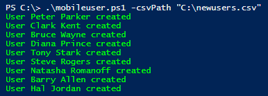
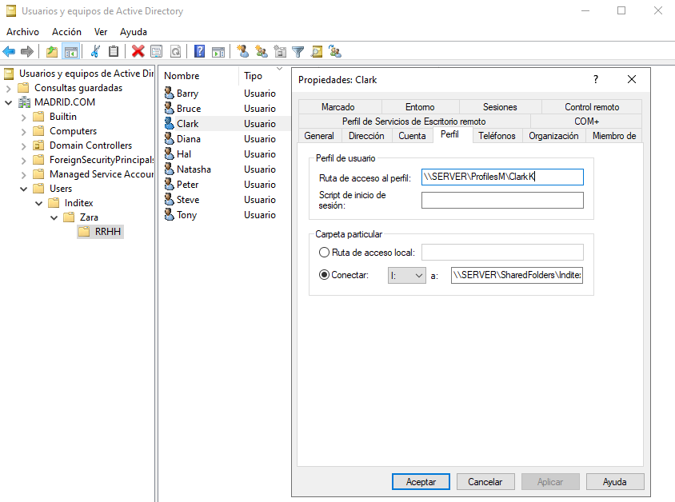

# createMobileUsers
> Script to massively create similar users with mobile profiles 
## Use
 Execute the script with the parameter of the csv's path
```shell
.\.\mobileuser.ps1 -csvPath "C:\file.csv"
```

